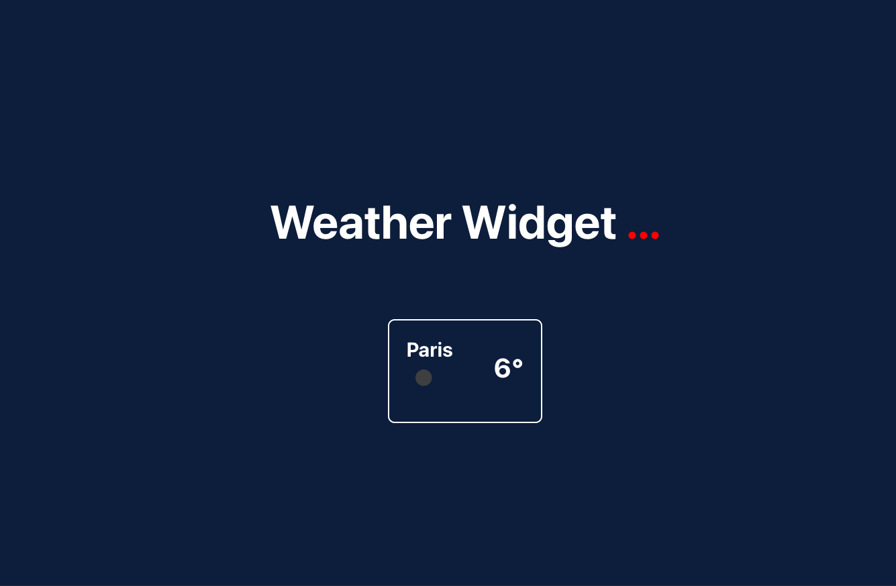

# :sun_behind_small_cloud: Create a weather widget

## Create a widget with create-react-app

## Illustration

## Language/tools
- HTML5 / CSS3 / SCSS
- Javascript / REACT / Hooks
- PropTypes
- Axios / API

## Goals 
- Discover a new starter : create-react-app
- Fetch data from an API
- UX / UI

## Status
Project completed

## Context
Project carried out during my training as a web developer

